# FPS Controller – Unity (Learning Project)

  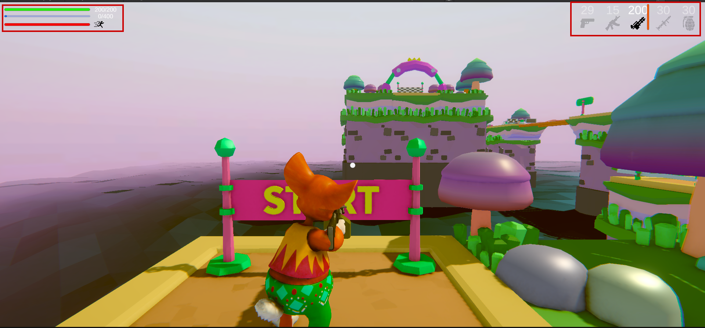

## 🎮 Descripción
Proyecto FPS-TPS desarrollado en Unity como parte de un proceso de aprendizaje paso a paso.  
El objetivo es construir un controlador FPS-TPS desde cero, entendiendo tanto la parte técnica (scripts) como la construcción del entorno (level design básico).

Este proyecto sigue un videotutorial dividido en múltiples capítulos, pero el foco está en **comprender y replicar los sistemas**, no solo copiarlos.

---

## 🎯 Objetivo del Proyecto

Este proyecto tiene como finalidad comprender la arquitectura de un juego FPS-TPS en Unity, implementando sistemas escalables como armas, enemigos, HUD dinámico, animaciones con Blend Tree, IK para manos y gestión de estados globales mediante un GameManager.

## 🎮 Jugabilidad (Controles – PC)

El juego está actualmente diseñado para jugarse en **PC**. En futuras versiones se considerará soporte para otros dispositivos.

### 🕹️ Controles

- **Movimiento:** `W`, `A`, `S`, `D`  
  *(o flechas ↑ ↓ ← →)*  
- **Saltar:** `Barra espaciadora`
- **Correr (Sprint):** `Shift`
- **Pausar juego:** `P`
- **Cambiar de arma:** `Tab`

Estos controles permiten desplazarse, superar obstáculos, enfrentar enemigos y avanzar a través de los distintos niveles del juego.

---

## 🎮 Screenshots

### 🧱 ❤️ Sistema de Vida y Resistencia (HUD)

El jugador cuenta con una barra de vida principal, una barra secundaria que se activa cuando la primera está completa, y una barra de resistencia que determina cuánto tiempo puede correr antes de agotarse, ofreciendo una gestión dinámica de supervivencia durante el combate. Además en la parte derecha se le muestra todas las armas disponibles que puede hacer uso para acabar con sus enemigos aéreos y terrestres, asi como la cantidad de municiones que tiene de cada una.

---

### 🛸 Enemigo Flotante con Púas

Este enemigo flota en el aire y está cubierto de púas, convirtiéndose en una amenaza constante mientras el jugador avanza. Si entra en contacto con él, pierde vida; sin embargo, puede ser derrotado utilizando el arma, lo que añade una alternativa ofensiva frente al peligro.

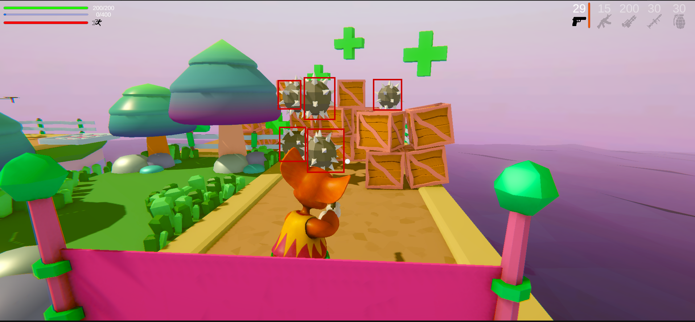
---

### ✨ Recolección de Vida

Al recoger un elemento de vida (cruz verde), se activa un efecto visual de partículas y la salud del jugador aumenta instantáneamente, reforzando la sensación de recompensa y recuperación en medio del juego.

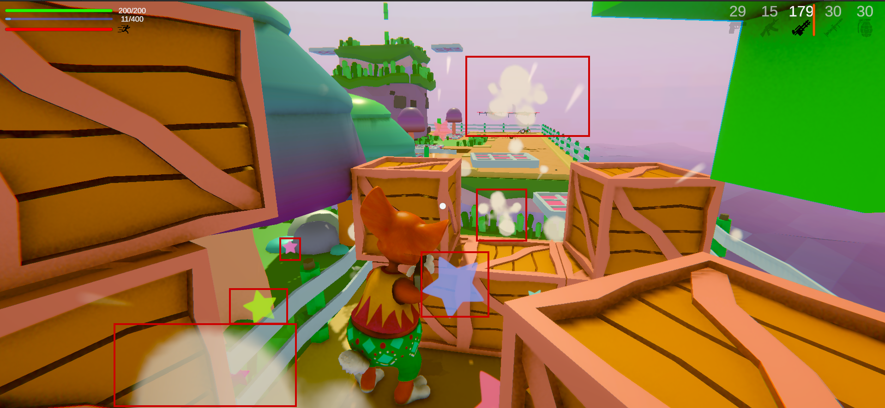
---

### 👾 Enemigos Aéreos y Terrestres

En determinados niveles aparecen enemigos terrestres y aéreos que detectan al jugador cuando se encuentra a cierta distancia y comienzan a atacarlo, aumentando la presión y el desafío durante la exploración. El jugador puede hacer uso de sus armas(mientras tengo municiones) para deribarlos.

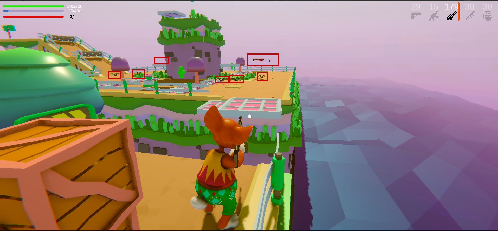
---

### ⚠️ Obstáculos Dinámicos – Trampa de Púas

A lo largo del nivel, el jugador debe superar distintos obstáculos que bloquean su avance. En esta sección se muestra una trampa de púas que se activa de forma intermitente: las púas emergen y se ocultan en intervalos, obligando al jugador a calcular el momento adecuado para avanzar. Si pisa las púas cuando están activas, pierde una cantidad de vida, aumentando el riesgo y la tensión en la exploración.

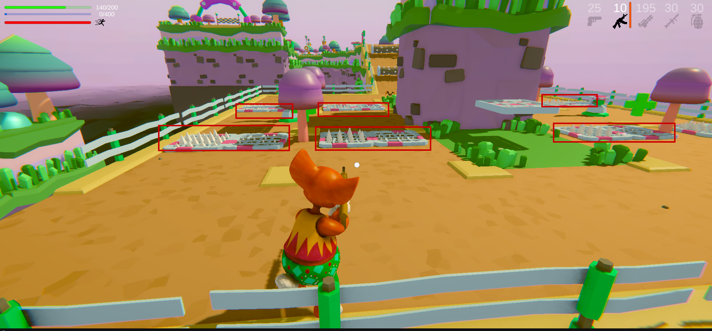
---

### 🔪 Enemigo Giratorio

Este enemigo se desplaza girando constantemente mientras sostiene un cuchillo afilado, convirtiéndose en una amenaza móvil dentro del nivel. Si el jugador entra en contacto con el arma durante el giro, recibe daño y pierde parte de su vida, obligándolo a calcular bien sus movimientos y el momento adecuado para acercarse o esquivar.

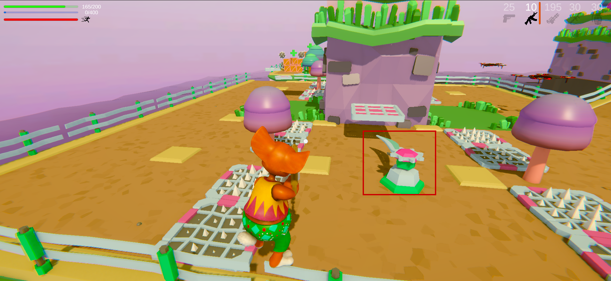
---

### 🌪️ Troncos Giratorios

En esta sección del nivel aparecen troncos giratorios que bloquean el paso del jugador. Su movimiento constante obliga a calcular el momento exacto para saltar y atravesarlos con seguridad. Si el jugador entra en contacto con ellos, pierde cierta cantidad devida, convirtiendo este obstáculo en un desafío de precisión y sincronización.

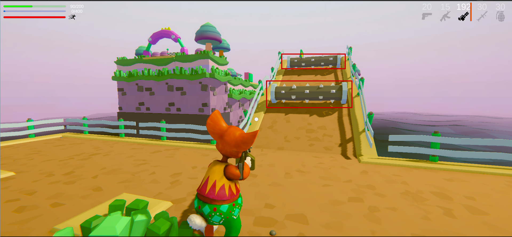
---

### ⚔️ Enemigo de Doble Filo

Este enemigo gira constantemente mientras sostiene dos cuchillas afiladas, ampliando su zona de peligro y dificultando el paso. Si el jugador entra en contacto con cualquiera de los filos, pierde una cantidad de vida, lo que exige mayor precisión al momento de esquivar y avanzar.

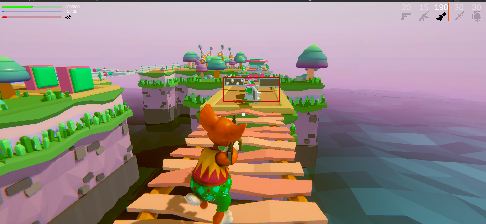
---

### 🚀 Plataforma Saltarina

Tras superar los enemigos anteriores, el jugador llega a una nueva zona donde encuentra una plataforma saltarina que lo impulsa automáticamente de un punto a otro. Este elemento es esencial para continuar al siguiente nivel, ya que sin utilizarlo no es posible alcanzar la siguiente área del escenario.

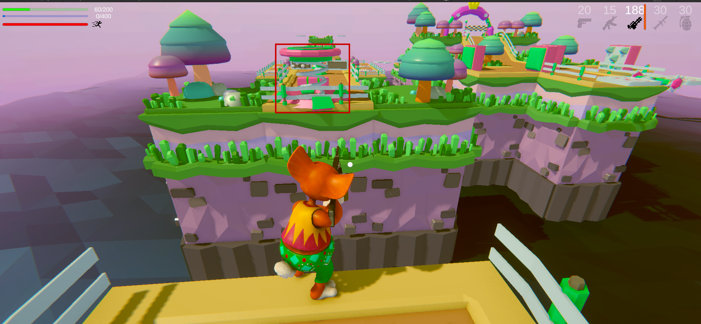
---

### ⚙️ Obstáculos Mecánicos – Cuchillas y Martillos

En esta zona aparecen dos tipos de amenazas. La primera consiste en cuchillas circulares que giran constantemente mientras se desplazan de izquierda a derecha, obligando al jugador a calcular con precisión el momento para avanzar, ya que cualquier contacto provoca pérdida de vida. La segunda son grandes martillos oscilantes que bloquean el camino; si golpean al jugador, lo empujan en la dirección del impacto, aumentando el riesgo de caer o recibir más daño.

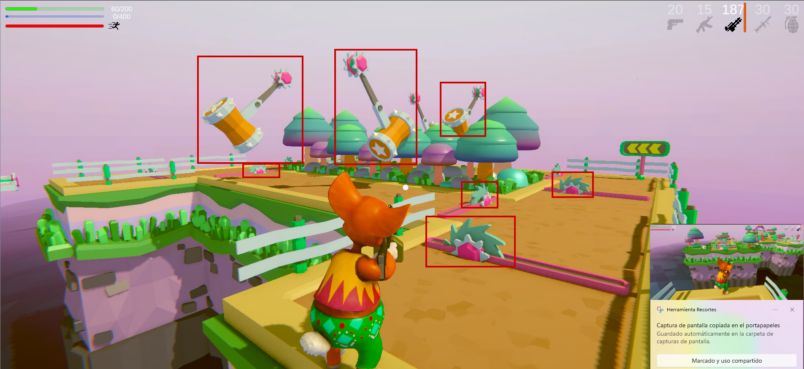
---

### 🏁 Desafío Final – Plataformas y Planchas Móviles

🏁 Desafío Final – Plataformas y Planchas Móviles

Antes de llegar a la meta, el jugador debe superar una plataforma que se mueve verticalmente, donde una caída implica reiniciar la vida. Tras ello, enfrenta el último obstáculo: dos grandes planchas que se desplazan en direcciones opuestas y también paralelas, cerrándose con fuerza al encontrarse. Si el jugador queda atrapado entre ellas, es aplastado y pierde vida, convirtiendo este tramo final en una prueba de precisión y sincronización.

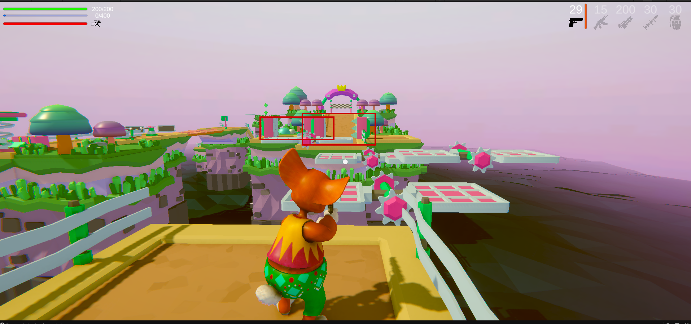
---

### 🟢 Pantalla de Victoria

Al alcanzar la meta, aparece una ventana verde translúcida que indica que el jugador ha completado el nivel con éxito. Este mensaje confirma que logró superar todos los obstáculos y enemigos del recorrido, marcando el final del desafío.

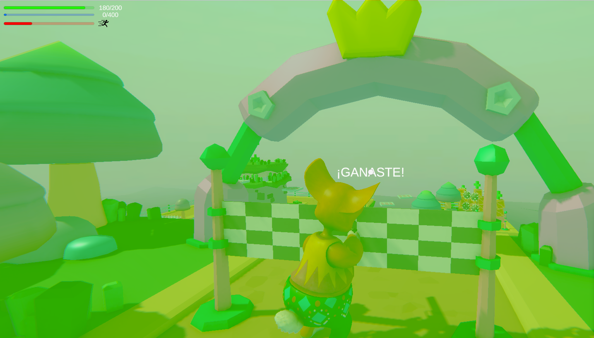
---

### ⏸️ Sistema de Pausa

El jugador puede pausar el juego presionando la tecla P, lo que muestra una pantalla translúcida de tono morado y detiene completamente la acción. Esta función permite hacer una pausa estratégica en cualquier momento sin perder el progreso actual.

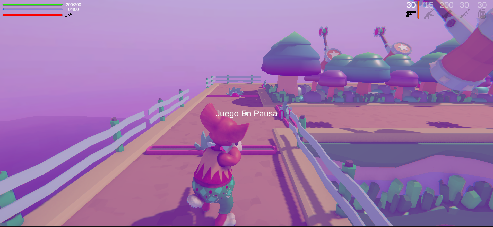
---

### 🔴 Sistema de Daño y Feedback Visual

En todos los niveles aparecen enemigos que atacan cuando el jugador se acerca a cierta distancia. Al recibir daño, la vida se reduce según la fuerza del enemigo y se activa un efecto visual con una pantalla semi-transparente roja junto a un sonido de impacto, reforzando la sensación de peligro y alerta durante el combate.

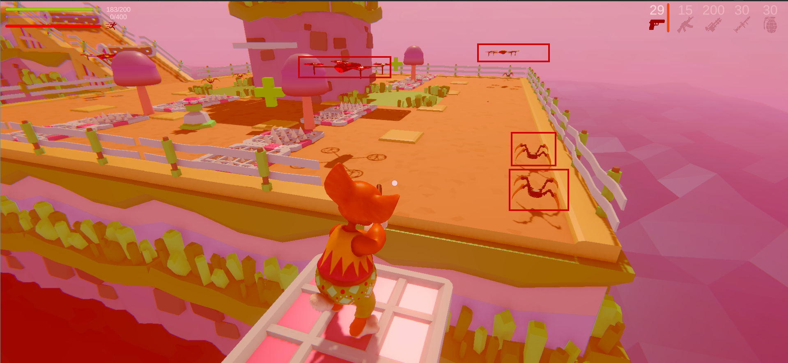
---

## 📚 Progreso actual

### ✅ Capítulo 01 – Introducción
- Presentación del proyecto
- Configuración inicial del entorno de trabajo
- Enfoque del tutorial y objetivos generales

---

### ✅ Capítulo 02 – Escena inicial y elementos básicos
- Creación del **suelo** del nivel
- Creación del **Player** usando una cápsula
- Agregado de elementos simples para interactuar en la escena
- Creación y aplicación de **Materials** para dar color y diferenciación visual a los objetos
- Organización básica de la escena

📌 En este punto el enfoque fue visual y estructural, sin lógica de control todavía.

---

### ✅ Capítulo 03 – Cámara FPS (Camera Look)
Implementación del sistema básico de cámara en primera persona.

#### Características:
- Control del mouse para rotación de cámara
- Separación de responsabilidades:
  - **Mouse X** → rota el cuerpo del jugador (yaw)
  - **Mouse Y** → rota solo la cámara (pitch)
- Uso de `localRotation` para evitar conflictos con la rotación del player
- Límite de rotación vertical usando `Mathf.Clamp`
- Bloqueo del cursor para experiencia FPS

#### Script principal:
- `Assets/Scripts/Camera/CameraLook.cs`

---

### ✅ Capítulo 04 – Movimiento del jugador
Implementación del movimiento básico del Player utilizando `CharacterController`.

#### Características:
- Movimiento en los ejes horizontal y vertical
- Movimiento relativo a la orientación del jugador
- Uso de `transform.forward` y `transform.right`
- Velocidad configurable
- Movimiento independiente del frame rate (`Time.deltaTime`)

#### Script:
- `Assets/Scripts/Player/PlayerMovement.cs`

---

### ✅ Capítulo 05 – Gravedad del jugador
Extensión del sistema de movimiento para incluir gravedad manual utilizando `CharacterController`.

#### Características:
- Aplicación de gravedad sin uso de `Rigidbody`
- Uso de una velocidad vertical acumulada (`velocity.y`)
- Integración de la gravedad con `CharacterController.Move`
- Separación entre movimiento horizontal y fuerza vertical
- Uso de `Time.deltaTime` para una simulación consistente

#### Script:
- `Assets/Scripts/Player/PlayerMovement.cs`

---

### ✅ Capítulo 06 – Salto y detección de suelo
Implementación del sistema de salto y detección de contacto con el suelo utilizando físicas manuales.

#### Características:
- Detección de suelo mediante `Physics.CheckSphere`
- Uso de `LayerMask` para identificar superficies caminables
- Control del estado `isGrounded` para permitir el salto
- Aplicación de fuerza de salto basada en la fórmula de movimiento vertical
- Uso de una pequeña fuerza negativa para mantener al jugador pegado al suelo
- Integración del salto con el sistema de gravedad manual

#### Script:
- `Assets/Scripts/Player/PlayerMovement.cs`

---

### ✅ Capítulos 07 & 08 – Arma básica y sistema de disparo
Integración de un arma al jugador y creación del sistema básico de disparo.

#### Características:
- Importación de un modelo de pistola desde el Asset Store
- Posicionamiento y rotación manual del arma respecto al jugador
- Arma configurada como hija de la cámara principal para seguir la vista del jugador
- Creación de un `spawnPoint` en la punta del arma
- Implementación de un sistema de disparo básico mediante instanciación de proyectiles
- Creación de un proyectil simple usando una esfera con `SphereCollider` y `Rigidbody`
- Uso del nuevo Input System para detectar el disparo con el botón izquierdo del mouse

#### Script:
- `Assets/Scripts/Weapon/Shot.cs`

---

### ✅ Capítulo 09 – Disparo con fuerza y colisiones
Mejora del sistema de disparo incorporando física, cadencia y detección de colisiones.

#### Características:
- Aplicación de fuerza al proyectil usando `Rigidbody.AddForce`
- Implementación de cadencia de disparo mediante control de tiempo
- Destrucción automática del proyectil tras un tiempo definido
- Detección de colisiones del proyectil
- Uso de tags para identificar enemigos
- Eliminación de enemigos al impacto del proyectil

#### Scripts:
- `Assets/Scripts/Weapon/Shot.cs`
- `Assets/Scripts/Weapon/Bullet.cs`

---

### ✅ Capítulo 10 – Animaciones básicas y NavMesh
Introducción a animaciones simples y configuración inicial del sistema de navegación.

#### Características:
- Creación de una animación básica mediante el sistema de Animation de Unity
- Animación de movimiento cíclico de un objeto en el eje Z
- Introducción al sistema de navegación usando NavMesh
- Configuración de `NavMeshSurface` sobre el piso con el área por defecto `Walkable`
- Preparación del escenario para futura navegación de enemigos

---

### ✅ Capítulo 11 – Navegación básica del enemigo
Implementación de un sistema de navegación simple para el enemigo utilizando `NavMeshAgent`.

#### Características:
- Uso de `NavMeshAgent` para mover al enemigo sobre el NavMesh
- Definición de destinos mediante puntos en la escena
- Cambio dinámico de destino según la distancia al objetivo
- Integración del enemigo con el sistema de navegación previamente configurado

#### Scripts:
- `Assets/Scripts/AI/AI.cs`
---

### ✅ Capítulo 12 – Balanceo del arma (Weapon Sway)
Implementación de un efecto de balanceo del arma basado en el movimiento del mouse para mejorar la sensación visual.

#### Características:
- Balanceo del arma según el movimiento del mouse
- Uso de rotaciones locales para mantener coherencia con la cámara
- Interpolación suave entre rotaciones usando `Quaternion.Lerp`
- Efecto visual que mejora la sensación de peso y realismo del arma

#### Script:
- `Assets/Scripts/Weapon/WeaponSway.cs`

---

### ✅ Capítulo 13 – Patrullaje del enemigo y seguimiento del jugador
Mejora del comportamiento del enemigo combinando patrullaje por puntos y seguimiento dinámico del jugador.

#### Características:
- Uso de múltiples puntos de destino para patrullaje del enemigo
- Selección dinámica del destino activo
- Cambio de destino al alcanzar un punto de patrulla
- Detección de proximidad al jugador mediante distancia
- Comportamiento condicional:
  - Patrullaje cuando el jugador está lejos
  - Seguimiento del jugador cuando entra en un rango definido
- Uso de `NavMeshAgent` para navegación continua y fluida

#### Script:
- `Assets/Scripts/AI/AI.cs`

---

### ✅ Capítulo 14 – Sistema de munición y Game Manager
Introducción de un sistema básico de munición y recolección utilizando un administrador global del juego.

#### Características:
- Importación de un asset de caja de munición desde el Asset Store
- Creación de un objeto de munición con `BoxCollider` configurado como `Is Trigger`
- Uso de un script simple para definir la cantidad de munición recogida
- Implementación de un `GameManager` como punto central de estado global
- Gestión de la munición del arma desde un sistema compartido
- Sistema de interacción del jugador mediante detección de `OnTriggerEnter`
- Recolección de munición y destrucción del objeto al ser recogido
- Modificación del sistema de disparo para consumir munición disponible

#### Scripts:
- `Assets/Scripts/World/GameManager.cs`
- `Assets/Scripts/Weapon/Gun.cs`
- `Assets/Scripts/World/AmmoBox.cs`
- `Assets/Scripts/Player/PlayerInteractions.cs`

---

### ✅ Capítulo 15 – Interfaz de usuario (HUD)
Implementación de una interfaz de usuario básica para mostrar información del jugador durante el juego.

#### Características:
- Creación de un Canvas para la interfaz de usuario
- Uso de textos e imágenes para mostrar munición y vida del jugador
- Posicionamiento del HUD:
  - Munición en la parte superior derecha
  - Vida del jugador en la parte inferior izquierda
- Configuración de imágenes UI usando `Texture Type: 2D and GUI`
- Actualización dinámica de valores de la interfaz desde el `GameManager`
- Visualización en tiempo real del contador de munición

#### Scripts:
- `Assets/Scripts/Managers/GameManager.cs`

---

### ✅ Capítulo 16 – Sistema básico de granadas
Implementación de un sistema de granadas con temporizador y efecto de explosión usando físicas.

#### Características:
- Creación de una granada simulada inicialmente con una esfera
- Reemplazo del modelo visual por un mesh y material descargados desde un asset
- Uso de un temporizador para retrasar la explosión
- Detección de objetos dentro de un radio de explosión
- Aplicación de fuerza de explosión a objetos con `Rigidbody`
- Destrucción de la granada tras la explosión

#### Scripts:
- `Assets/Scripts/Weapon/Grenade.cs`

---

### ✅ Capítulo 17.1 – Sistema de cambio de armas
Implementación de un controlador de armas que permite alternar entre distintos tipos de armas y actualizar la interfaz de usuario en función del arma activa.

#### Características:
- Creación de un `WeaponController` para gestionar el arma activa del jugador
- Organización de las armas bajo una jerarquía común (`Weapons`)
- Activación y desactivación de armas mediante `SetActive`
- Cambio de armas usando teclas numéricas:
  - `1` → Pistola
  - `2` → Granada
- Representación visual del arma equipada (pistola o granada)
- Gestión de munición independiente por tipo de arma
- Actualización dinámica del HUD según el arma activa:
  - Cambio de icono del arma
  - Actualización del contador de munición

#### Scripts:
- `Assets/Scripts/Player/WeaponController.cs`
- `Assets/Scripts/Managers/GameManager.cs`
- `Assets/Scripts/Weapon/Gun.cs`
- `Assets/Scripts/Player/PlayerInteractions.cs`

---

### ✅ Capítulo 17.2 – Lanzamiento de granadas
Implementación del sistema de lanzamiento de granadas como un arma independiente, integrada con el controlador de armas y el HUD.

#### Características:
- Creación de un arma de tipo granada con comportamiento propio
- Uso de un `GrenadeSpawnPoint` independiente al arma de fuego
- Lanzamiento de granadas mediante click izquierdo cuando la granada está equipada
- Aplicación de fuerza al proyectil para simular un lanzamiento con arco
- Consumo de munición de granadas desde el `GameManager`
- Actualización del HUD tras lanzar una granada
- Integración del sistema de granadas con el `WeaponController`

#### Scripts:
- `Assets/Scripts/Weapon/GrenadeWeapon.cs`
- `Assets/Scripts/Managers/GameManager.cs`
- `Assets/Scripts/Player/WeaponController.cs`

---

### ✅ Capítulo 17.3 – Sistema de cooldown por arma
Implementación de una barra de cooldown dinámica en la interfaz que refleja el tiempo de recarga de cada arma activa.

#### Características:
- Uso de un `Slider` como barra de cooldown en el HUD
- Representación visual del tiempo de espera antes de reutilizar un arma
- Sistema de cooldown independiente por arma:
  - Pistola con cooldown corto por disparo
  - Granada con cooldown más largo por lanzamiento
- Actualización progresiva de la barra en función del tiempo restante
- Reutilización de una única barra de cooldown para todas las armas
- Integración del cooldown con el sistema de cambio de armas
- Reinicio del cooldown al usar el arma

#### Scripts:
- `Assets/Scripts/UI/CooldownUI.cs`
- `Assets/Scripts/Weapon/Gun.cs`
- `Assets/Scripts/Weapon/GrenadeWeapon.cs`

---

### ✅ Capítulo 17.4 – Efecto visual de explosión de granadas
Implementación de un efecto visual de explosión utilizando un sistema de partículas, integrado al comportamiento de la granada.

#### Características:
- Creación y configuración de un `Particle System` para la explosión
- Conversión del sistema de partículas en un prefab reutilizable
- Instanciación del efecto visual al momento de la explosión
- Sincronización del efecto visual con la lógica de explosión
- Aplicación de fuerza de explosión a objetos cercanos con `Rigidbody`
- Destrucción automática de la granada tras la explosión

#### Scripts:
- `Assets/Scripts/Weapon/Grenade.cs`

---

### ✅ Capítulo 18 – Enemigos y animaciones básicas
Incorporación de nuevos enemigos al escenario y aplicación de animaciones simples para darles vida y presencia visual.

#### Características:
- Importación y colocación de nuevos enemigos en la escena:
  - Araña
  - Dron
- Configuración inicial de modelos y jerarquías
- Aplicación de animaciones básicas:
  - Rotaciones en las patas de la araña para simular movimiento
  - Rotaciones en el dron para dar sensación de actividad y flotación
- Uso de transformaciones simples como primer acercamiento a la animación
- Preparación de los enemigos para futuras mejoras de comportamiento y animación avanzada

---

### ✅ Capítulo 19 – Daño por caída y respawn del jugador
Implementación de un sistema de daño ambiental que penaliza al jugador al caer fuera del escenario y gestiona su respawn o reinicio.

#### Características:
- Creación de una base inferior (`DeathFloor`) debajo del escenario principal
- Detección de colisión del jugador con zonas de muerte mediante `Trigger`
- Aplicación de daño al jugador al caer fuera del mapa
- Sistema de reducción de vida del jugador
- Respawn del jugador en una posición inicial configurable
- Reinicio de la escena cuando la vida del jugador llega a cero
- Actualización del estado de vida en la interfaz de usuario

#### Scripts:
- `Assets/Scripts/Player/PlayerInteractions.cs`
- `Assets/Scripts/Managers/GameManager.cs`

---

### ✅ Capítulo 20 – Ataque de enemigos a distancia
Implementación del sistema de ataque de los enemigos mediante disparos, incluyendo proyectiles, detección de impacto y daño al jugador.

#### Características:
- Creación de un sistema de disparo para enemigos basado en distancia al jugador
- Disparo condicionado por rango de ataque y cooldown
- Instanciación de proyectiles enemigos desde un punto de disparo
- Aplicación de fuerza al proyectil en dirección al jugador
- Creación de un prefab de bala enemiga con tiempo de vida limitado
- Detección de colisiones entre la bala enemiga y el jugador
- Reducción de la vida del jugador al recibir daño de un enemigo
- Integración del sistema de ataque con la lógica de vida del jugador

#### Scripts:
- `Assets/Scripts/Enemy/EnemyShoot.cs`
- `Assets/Scripts/Enemy/BulletEnemy.cs`
- `Assets/Scripts/Player/PlayerInteractions.cs`

---

### ✅ Capítulo 21 – Blocking Nivel
Implementación del los niveles del juego.

---

### ✅ Capítulo 22 – Sistema de pausa del juego
Implementación de un sistema de pausa que permite detener y reanudar el juego mostrando un menú en pantalla.

#### Características:
- Creación de un panel de pausa dentro del Canvas
- Visualización de un mensaje de “Juego en Pausa”
- Control de pausa mediante una tecla (`P`)
- Congelación completa del juego usando `Time.timeScale`
- Activación y desactivación del menú de pausa según el estado del juego
- Integración del sistema de pausa con el `GameManager`

#### Scripts:
- `Assets/Scripts/UI/Menu.cs`
- `Assets/Scripts/Managers/GameManager.cs`

---

### ✅ Capítulo 23 – Sistema de audio para armas y granadas
Incorporación de efectos de sonido para disparos y explosiones, integrados directamente en los prefabs de armas y granadas.

#### Características:
- Uso del componente `AudioSource` en los prefabs de arma y granada
- Reproducción de sonido de disparo mediante `PlayOneShot`
- Reproducción de sonido de explosión al detonar una granada
- Integración del audio con el sistema de cooldown del arma
- Sincronización entre disparo, sonido y HUD
- Desactivación visual de la granada tras la explosión antes de su destrucción

#### Scripts:
- `Assets/Scripts/Weapon/Gun.cs`
- `Assets/Scripts/Weapon/Grenade.cs`

---

### ✅ Capítulo 24 – Sistema de sprint del jugador
Incorporación de la mecánica de carrera (sprint) que permite al jugador moverse más rápido de forma dinámica durante el gameplay.

#### Características:
- Implementación de un sistema de sprint activado mediante la tecla `Left Shift`
- Alternancia entre caminar y correr usando un estado booleano
- Modificación dinámica de la velocidad de movimiento del jugador
- Integración del sprint con el sistema de movimiento existente basado en `CharacterController`
- Control limpio del multiplicador de velocidad sin duplicar lógica de movimiento

#### Scripts:
- `Assets/Scripts/Player/PlayerMovement.cs`

---

### ✅ Capítulo 25 – Sistema de stamina para el sprint
Implementación de un sistema de stamina visual y funcional que limita el uso del sprint del jugador mediante un `Slider` en la interfaz.

#### Características:
- Creación de un `Slider` en el Canvas para representar la stamina del jugador
- Inicialización de valores máximos y actuales de stamina
- Consumo progresivo de stamina al correr
- Regeneración automática de stamina tras un tiempo sin correr
- Uso de corrutinas para manejar pérdida y regeneración de stamina
- Desactivación automática del sprint cuando la stamina se agota
- Integración directa del sistema de stamina con el movimiento del jugador

#### Scripts:
- `Assets/Scripts/UI/RunningSliderUI.cs`
- `Assets/Scripts/Player/PlayerMovement.cs`

---

### ✅ Capítulo 26 – Sistema de armas escalable y UI dinámica

Refactor completo del sistema de armas para soportar múltiples tipos de armas de forma escalable, desacoplada y con una interfaz dinámica que se adapta al arma activa.

#### Características:
- Creación de una clase base `WeaponBase` para unificar el comportamiento común de todas las armas
- Gestión de munición y cooldown de forma individual por arma
- Implementación de armas concretas (`Gun`, `M4_8`, `GrenadeWeapon`, `LaserWeapon`) heredando de `WeaponBase`
- Centralización del control de armas mediante `WeaponController`
- Cambio de arma utilizando la tecla `TAB`
- Soporte para armas de uso único y armas de uso continuo (láser)
- Creación de una interfaz dinámica basada en slots de armas
- Visualización de icono y munición por cada arma
- Visualización del cooldown únicamente en el arma actualmente equipada
- Refactor del `GameManager`, eliminando la gestión de munición y dejándolo como gestor de estado global
- Actualización de `PlayerInteractions` para que los pickups de munición afecten al arma activa

#### Scripts:
- `Assets/Scripts/Weapons/WeaponBase.cs`
- `Assets/Scripts/Weapons/Gun.cs`
- `Assets/Scripts/Weapons/M4_8.cs`
- `Assets/Scripts/Weapons/GrenadeWeapon.cs`
- `Assets/Scripts/Weapons/LaserWeapon.cs`
- `Assets/Scripts/Player/WeaponController.cs`
- `Assets/Scripts/UI/WeaponSlotUI.cs`
- `Assets/Scripts/World/GameManager.cs`
- `Assets/Scripts/Player/PlayerInteractions.cs`

---

### ✅ Capítulo 27 – Cambio de cámara en primera y tercera persona

Implementación de un sistema de cambio dinámico entre cámara en primera persona y tercera persona, permitiendo alternar la perspectiva del jugador durante el gameplay.

#### Características:
- Uso de dos cámaras independientes (First Person y Third Person)
- Activación y desactivación de cámaras mediante una sola tecla
- Alternancia de estado usando una variable booleana
- Cambio inmediato de perspectiva sin recargar la escena
- Sistema fácilmente extensible para futuras cámaras (cinemática, espectador, etc.)

#### Scripts:
- `Assets/Scripts/Camera/CameraSwitch.cs`

---

### ✅ Capítulo 27.1 – Daño por granadas y pickups de vida

Implementación de daño a enemigos mediante explosiones de granadas y creación de un sistema de pickups de vida con animación flotante para el jugador.

#### Características:
- Aplicación de daño a enemigos dentro del radio de explosión de la granada
- Uso de colliders y `OnTriggerEnter` para detección de pickups
- Creación de un objeto de vida (`HealthObject`) que incrementa la salud del jugador
- Configuración del pickup de vida mediante `BoxCollider` con `isTrigger`
- Integración del sistema de vida con el `GameManager`
- Implementación de una animación flotante continua para pickups usando funciones trigonométricas
- Limpieza del objeto pickup tras ser recolectado

#### Scripts:
- `Assets/Scripts/Player/PlayerInteractions.cs`
- `Assets/Scripts/Pickups/HealthObject.cs`
- `Assets/Scripts/Pickups/FloatingObject.cs`
- `Assets/Scripts/Weapons/Grenade.cs`

---

### ✅ Capítulo 28-29 – Animación de personaje con Blend Tree (locomoción básica)

Integración de un personaje animado utilizando animaciones de Mixamo y un sistema de locomoción basado en `Blend Tree`, permitiendo transiciones suaves entre idle, caminar y desplazamientos laterales.

#### Características:
- Importación de personaje y animaciones desde Mixamo
- Configuración del Rig como Humanoid y uso de un Avatar compartido
- Creación de un `Animator Controller` con `Blend Tree`
- Uso de parámetros `VelX` y `VelZ` para controlar la animación
- Implementación de un `Blend Tree 2D Freeform Directional`
- Animaciones configuradas para idle, caminar adelante, atrás y strafe
- Corrección de animación continua desactivando `Motion Time` en el Blend Tree
- Integración de las animaciones con el movimiento del jugador
- Separación entre lógica de movimiento y lógica de animación

#### Scripts:
- `Assets/Scripts/Player/PlayerMovement.cs`

---

### ✅ Capítulo 30 – Animaciones de correr y saltar

Extensión del sistema de animaciones del personaje incorporando animaciones de correr y saltar, integradas con el sistema de movimiento y el `Animator Controller`.

#### Características:
- Creación de un nuevo `Blend Tree` para animaciones de correr
- Transiciones controladas entre caminar y correr mediante el parámetro `isRunning`
- Implementación de una animación de salto independiente
- Uso de `Any State` para iniciar el salto desde cualquier estado
- Control del estado de salto mediante el parámetro `isJumping`
- Corrección de la lógica de salto para mantener la animación activa durante el tiempo en el aire
- Transiciones limpias entre salto, caminar y correr al aterrizar
- Integración directa con el sistema de movimiento del jugador

#### Scripts:
- `Assets/Scripts/Player/PlayerMovement.cs`

---

### ✅ Capítulo 31-32 – Configuración de manos con IK (Inverse Kinematics)

Implementación de un sistema de Inverse Kinematics para las manos del personaje utilizando el Animation Rigging Package, permitiendo que las manos se ajusten dinámicamente a la posición del arma.

#### Características:
- Instalación y uso del paquete **Animation Rigging**
- Creación de un `Rig` dentro del personaje para controlar IK
- Configuración de IK independiente para mano derecha e izquierda
- Uso del componente `Two Bone IK Constraint`
- Asignación de `Root`, `Mid` y `Tip` correspondientes a los huesos del brazo
- Uso de objetos `Target` para posicionar las manos sobre el arma
- Ajuste dinámico de la posición de las manos según el arma equipada
- Base preparada para soportar múltiples armas con diferentes puntos de agarre

#### Scripts / Componentes:
- `Unity.Animation.Rigging` (package)
- `Two Bone IK Constraint`
- `Rig` (Animation Rigging)

---

## 🛠️ Tecnologías utilizadas

- Unity (3D)
- C#
- CharacterController
- NavMesh & NavMeshAgent
- Unity UI System
- Animation & Blend Trees
- Animation Rigging (IK)
- Particle System
- Audio System